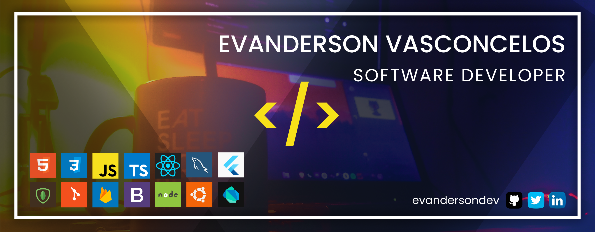

<h1 algin="center">
  
</h1>

---

## Hello guys 👋
### Welcome to my world

My name is **Evanderson Vasconcelos**, currently learning about Node, ReactJS, React Native and Typescript, I love everything about javascript and I'm also studying English.

**<a href="http://evandersondev.netlify.app">
  Portfolio
</a>**
